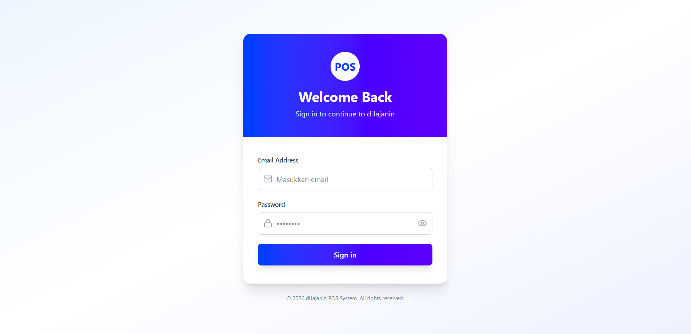
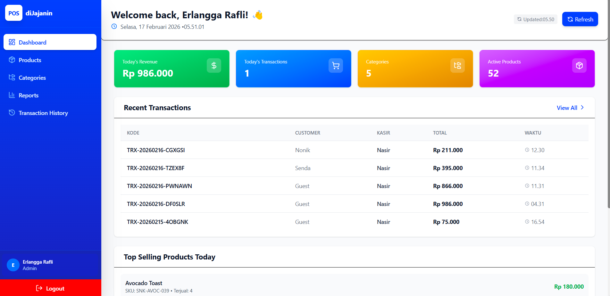
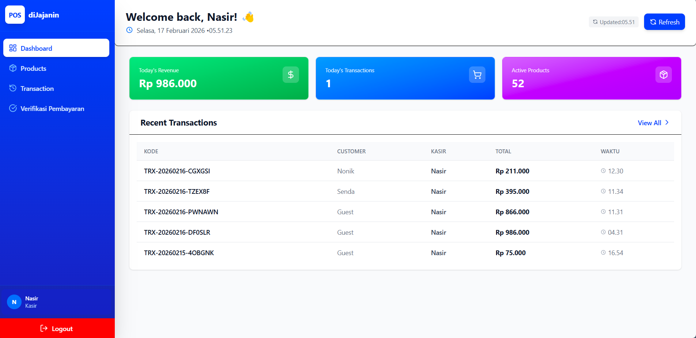
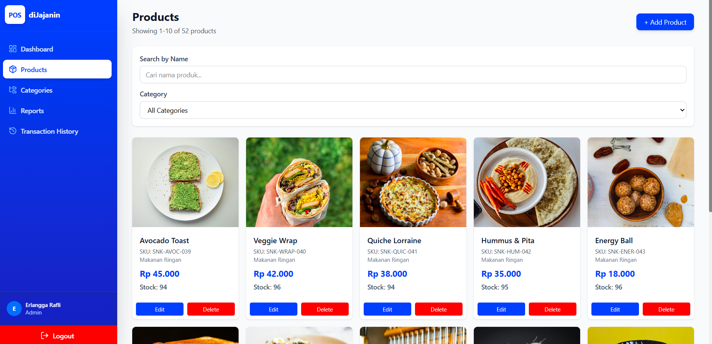
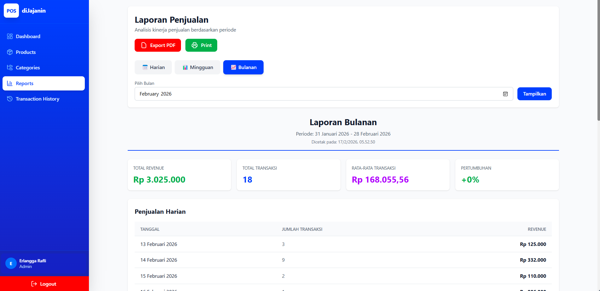

# diJajanin POS - Frontend

Modern Point of Sale (POS) system frontend yang dibangun dengan React, Vite, dan Tailwind CSS. Interface yang responsive dan user-friendly untuk manajemen toko/restoran dengan role-based UI.


## 🔗 Links

- **Backend API Repository:** [POS-API](https://github.com/rafli19/POS-API)
- **Live Demo:** https://pos.rafvoid.my.id
- **API Base URL:** https://pos-api.rafvoid.my.id/api/v1

## ✨ Fitur Utama

- ⚡ **Fast & Responsive** dengan Vite build tool
- 🎨 **Modern UI/UX** dengan Tailwind CSS
- 📱 **Mobile-First Design** - responsive di semua device
- 🔐 **Secure Authentication** dengan token-based auth
- 👥 **Role-based Interface** - UI sesuai user role (Admin/Owner/Kasir)
- 🔄 **Real-time Updates** - auto refresh setiap 10 detik
- 🖼️ **Image Management** dengan lazy loading
- 🔍 **Advanced Search & Filter** untuk produk
- 📄 **Smart Pagination** untuk performa optimal
- 🎯 **Optimized Performance** dengan React.memo dan lazy loading

## 🛠 Tech Stack

- **Framework:** React 18.x
- **Build Tool:** Vite 5.x
- **Styling:** Tailwind CSS 3.x
- **Routing:** React Router DOM 6.x
- **HTTP Client:** Axios
- **Icons:** Lucide React
- **State Management:** React Context API
- **Form Handling:** React Hooks

## 📋 Requirements

- Node.js 18+ 
- npm atau yarn
- Backend API running (lihat [Backend Repository](https://github.com/rafli19/POS-API))

## 🚀 Installation

### 1. Clone Repository

```bash
git clone https://github.com/yourusername/dijajanin-pos-frontend.git
cd dijajanin-pos-frontend
```

### 2. Install Dependencies

```bash
npm install
# atau
yarn install
```

### 3. Environment Setup

```bash
# Copy environment file
cp .env.example .env
```

Edit `.env`:

```env
VITE_API_BASE_URL=http://localhost:8000/api/v1
VITE_PUBLIC_URL=http://localhost:8000
```

### 4. Start Development Server

```bash
npm run dev
# atau
yarn dev
```

Frontend akan berjalan di: `http://localhost:5173`

## 🔑 Default Login Credentials

Login dengan credentials dari backend (setelah seeding):

| Role | Email | Password | Dashboard Access |
|------|-------|----------|------------------|
| **Admin** | admin@mail.com | admin123 | Dashboard, Products CRUD, Categories CRUD, Transaction History, Reports |
| **Owner** | owner@mail.com | owner123 | Dashboard, Products (view), Transaction History, Reports |
| **Kasir** | kasir@mail.com | kasir123 | Dashboard, Products (view), Create Transaction, Verify Payment |

## 📸 Screenshots

### Login Page

*Secure authentication dengan role-based access*

### Dashboard - Admin

*Dashboard untuk Admin dengan 4 cards statistics*

### Dashboard - Kasir

*Dashboard untuk Kasir dengan 3 cards (centered layout)*

### Products Management

*Product management dengan search, filter, dan pagination*

### Transaction - Kasir

*Interface transaksi untuk kasir dengan cart system*

### Reports - Admin/Owner

*Comprehensive reports untuk business intelligence*

## 📁 Project Structure

```
dijajanin-pos-frontend/
├── src/
│   ├── components/
│   │   └── Layout.jsx              # Main layout wrapper
│   ├── context/
│   │   └── AuthContext.jsx         # Authentication context
│   ├── pages/
│   │   ├── Login.jsx               # Login page
│   │   ├── Dashboard.jsx           # Dashboard (role-based)
│   │   ├── Products.jsx            # Products management
│   │   ├── Categories.jsx          # Categories management
│   │   ├── Transaction.jsx         # Create transaction (kasir)
│   │   ├── TransactionHistory.jsx  # Transaction history
│   │   └── Reports.jsx             # Reports page
│   ├── services/
│   │   └── api.js                  # API service & axios config
│   ├── App.jsx                     # Main app component
│   └── main.jsx                    # Entry point
├── public/
│   └── images/
│       └── no-image.png            # Placeholder image
├── .env                            # Environment variables
├── .env.example                    # Environment template
├── index.html
├── package.json
├── tailwind.config.js
├── vite.config.js
└── README.md
```

## 🎨 Features by Role

### 🔴 Admin Features
- ✅ Dashboard dengan 4 cards (Revenue, Transactions, Categories, Products)
- ✅ Products Management (Create, Read, Update, Delete)
- ✅ Categories Management (Full CRUD)
- ✅ Transaction History (View & Filter)
- ✅ Reports (Sales, Stock, Transactions, Kasir Performance)

### 🟡 Owner Features
- ✅ Dashboard dengan 4 cards (Revenue, Transactions, Categories, Products)
- ✅ Products (Read only - untuk monitoring)
- ✅ Transaction History (View & Filter)
- ✅ Reports (All reports for business intelligence)

### 🟢 Kasir Features
- ✅ Dashboard dengan 3 cards **centered** (Revenue, Transactions, Products)
- ✅ Products (Read only - untuk transaksi)
- ✅ Create Transaction (Add items, select payment, process)
- ✅ Verify Payment (Confirm/Cancel transactions)

## 🔌 API Integration

### Base Configuration

```javascript
// src/services/api.js
const API_BASE_URL = import.meta.env.VITE_API_BASE_URL;

const api = axios.create({
  baseURL: API_BASE_URL,
  headers: {
    'Content-Type': 'application/json',
    'Accept': 'application/json',
  },
});
```

### Authentication

```javascript
// Login
const response = await authAPI.login({ email, password });
localStorage.setItem('token', response.data.data.token);

// Logout
await authAPI.logout();
localStorage.removeItem('token');
```

### Protected Routes

```javascript
// App.jsx
<Route 
  path="/dashboard" 
  element={
    <ProtectedRoute>
      <Dashboard />
    </ProtectedRoute>
  } 
/>
```

## 🎨 Styling & UI Components

### Tailwind Configuration

```javascript
// tailwind.config.js
export default {
  content: [
    "./index.html",
    "./src/**/*.{js,ts,jsx,tsx}",
  ],
  theme: {
    extend: {
      colors: {
        primary: '#3B82F6',
        secondary: '#10B981',
      },
    },
  },
  plugins: [],
}
```

### Responsive Grid

```jsx
// Dashboard Cards - Dynamic grid
const gridCols = stats.length === 3 
  ? "grid-cols-1 sm:grid-cols-3"  // Kasir: 3 cards centered
  : "grid-cols-2 lg:grid-cols-4"; // Admin/Owner: 4 cards

<div className={`grid ${gridCols} gap-4`}>
  {stats.map(stat => <StatCard {...stat} />)}
</div>
```

## 🚀 Build & Deployment

### Build for Production

```bash
# Build
npm run build
# atau
yarn build

# Preview build
npm run preview
# atau
yarn preview
```

Output akan ada di folder `dist/`

### Deploy to Vercel

```bash
# Install Vercel CLI
npm install -g vercel

# Deploy
vercel --prod
```

### Deploy to Netlify

```bash
# Build
npm run build

# Deploy via Netlify CLI
npm install -g netlify-cli
netlify deploy --prod --dir=dist
```

### Environment Variables (Production)

```env
VITE_API_BASE_URL=https://pos-api.yourdomain.com/api/v1
VITE_PUBLIC_URL=https://pos-api.yourdomain.com
```

## ⚙️ Configuration Files

### vite.config.js

```javascript
import { defineConfig } from 'vite'
import react from '@vitejs/plugin-react'

export default defineConfig({
  plugins: [react()],
  server: {
    port: 5173,
    proxy: {
      '/api': {
        target: 'http://localhost:8000',
        changeOrigin: true,
      },
    },
  },
})
```

## 🐛 Troubleshooting

### CORS Error
**Problem:** Frontend tidak bisa akses backend

**Solution:**
- Pastikan backend `.env` memiliki:
```env
CORS_ALLOWED_ORIGINS=http://localhost:5173
```
- Clear backend cache: `php artisan config:clear`

### 403 Forbidden
**Problem:** User tidak punya akses ke endpoint

**Solution:**
- Cek role user di localStorage
- Pastikan routes di backend sudah benar untuk role tersebut

### Images Not Loading
**Problem:** Gambar produk tidak muncul

**Solution:**
```javascript
// services/api.js
export const getImageUrl = (path) => {
  if (!path) return "/images/no-image.png";
  if (path.startsWith("http")) return path;
  return `${import.meta.env.VITE_PUBLIC_URL}/storage/${path}`;
};
```

### Slow Products Page
**Problem:** Halaman products lag

**Solution:**
- Sudah dioptimasi dengan React.memo
- Image lazy loading sudah aktif
- Pagination max 10 items
- Debounce search 800ms

## 📦 Available Scripts

```bash
# Development
npm run dev          # Start dev server

# Build
npm run build        # Build for production
npm run preview      # Preview production build

# Linting
npm run lint         # Run ESLint
```

## 🎯 Performance Optimization

### Code Splitting

```javascript
// Lazy load pages
const Dashboard = lazy(() => import('./pages/Dashboard'));
const Products = lazy(() => import('./pages/Products'));

// Wrap in Suspense
<Suspense fallback={<Loading />}>
  <Dashboard />
</Suspense>
```

### Image Optimization

```jsx
// Lazy loading images

```

### Memoization

```javascript
// Memoize expensive calculations
const sortedProducts = useMemo(() => {
  return products.sort((a, b) => a.price - b.price);
}, [products]);

// Memoize callbacks
const handleSearch = useCallback((value) => {
  setSearchTerm(value);
}, []);
```

## 🧪 Testing (Optional)

```bash
# Install testing dependencies
npm install -D @testing-library/react @testing-library/jest-dom vitest

# Run tests
npm run test
```

## 🤝 Contributing

1. Fork the repository
2. Create feature branch (`git checkout -b feature/AmazingFeature`)
3. Commit changes (`git commit -m 'Add AmazingFeature'`)
4. Push to branch (`git push origin feature/AmazingFeature`)
5. Open a Pull Request

## 📄 License

This project is licensed under the MIT License.

## 👨‍💻 Developer

**Raferl**
- Email: raflierlangga141@gmail.com
- GitHub: [@rafli19](https://github.com/rafli19)
- Website: https://rafvoid.my.id

## 🙏 Acknowledgments

- [React](https://react.dev/)
- [Vite](https://vitejs.dev/)
- [Tailwind CSS](https://tailwindcss.com/)
- [Lucide Icons](https://lucide.dev/)
- [React Router](https://reactrouter.com/)

---

**Made by Raferl**

*Last Updated: February 2026*
